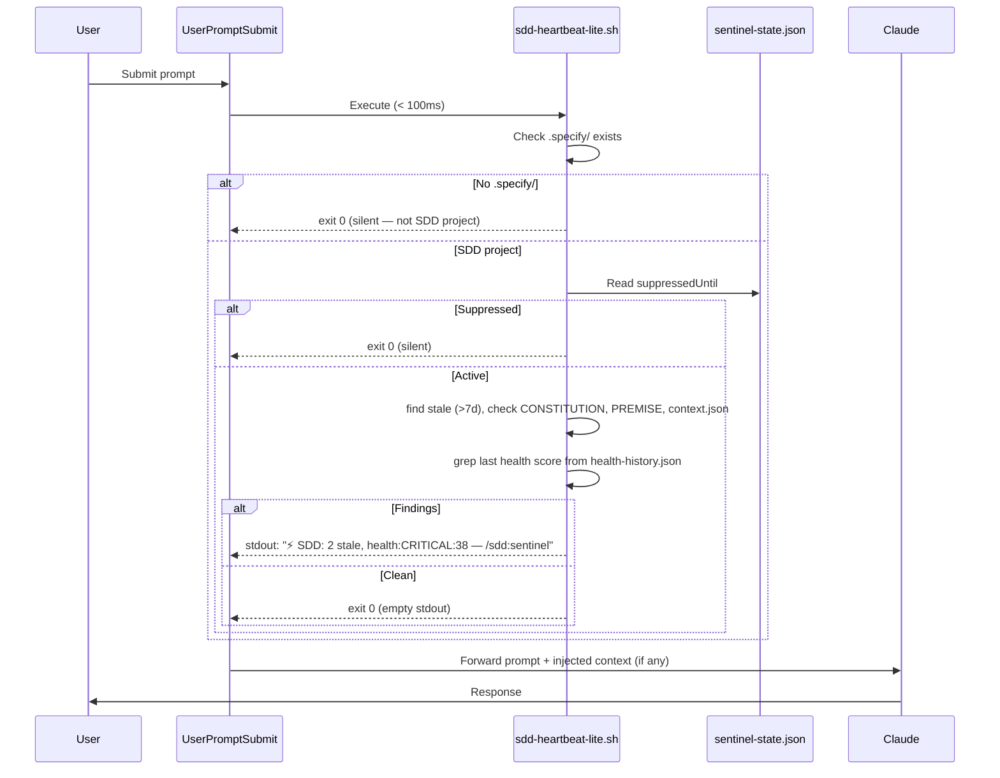
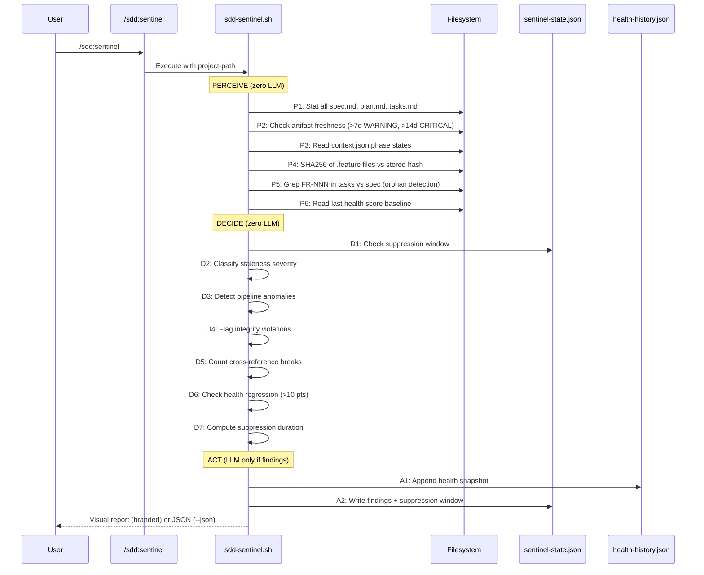
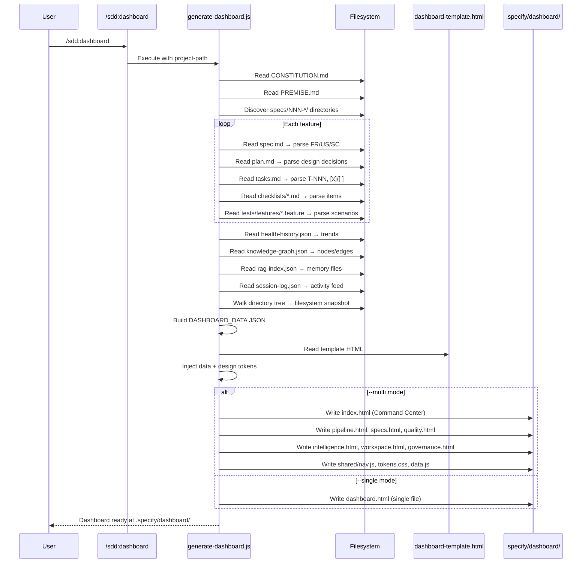
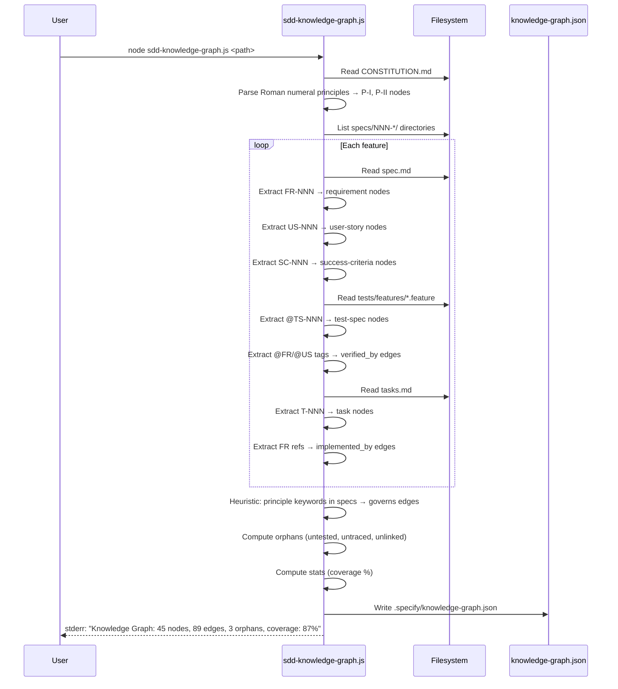
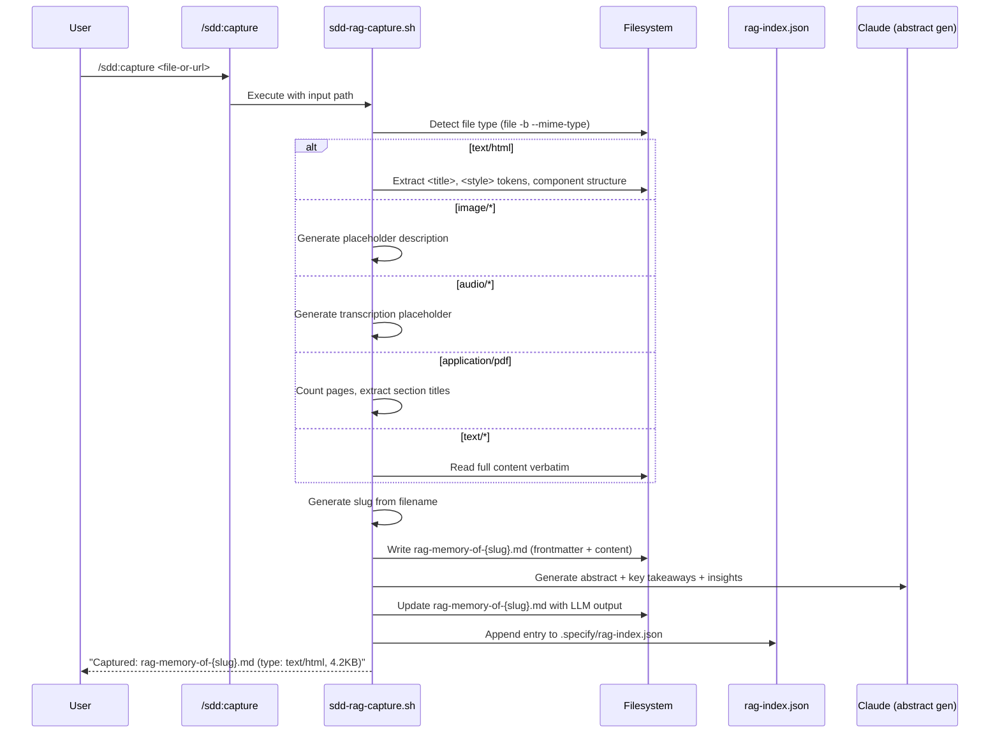
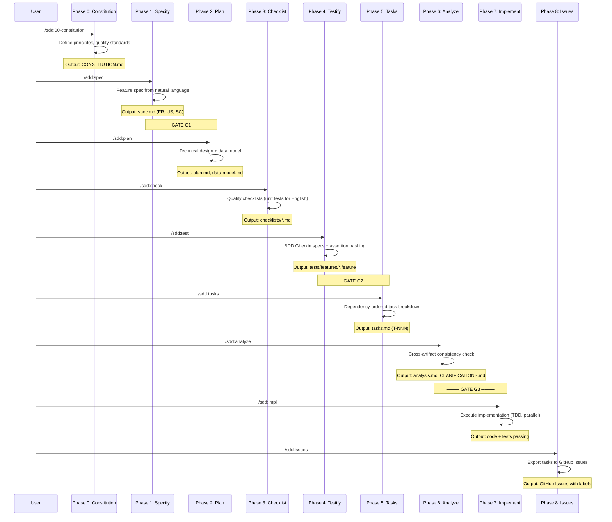
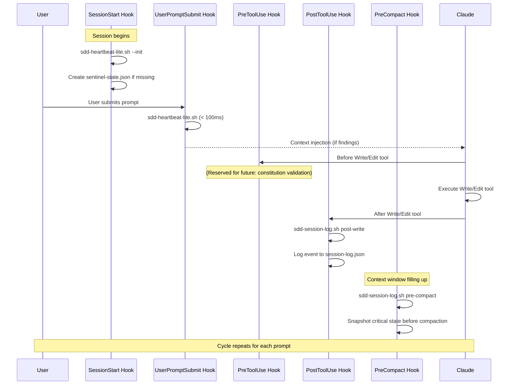

# SDD Sequence Diagrams — Tool Use Flows

> Mermaid diagrams documenting every SDD automation flow.
> SDD v3.5 · MetodologIA

---

## 1. Per-Prompt Heartbeat

---

## 2. Full Sentinel Cycle

---

## 3. Dashboard Generation

---

## 4. Knowledge Graph Build

---

## 5. RAG Capture Flow

---

## 6. SDD Full Pipeline (9 Phases)

---

## 7. Hook Lifecycle

